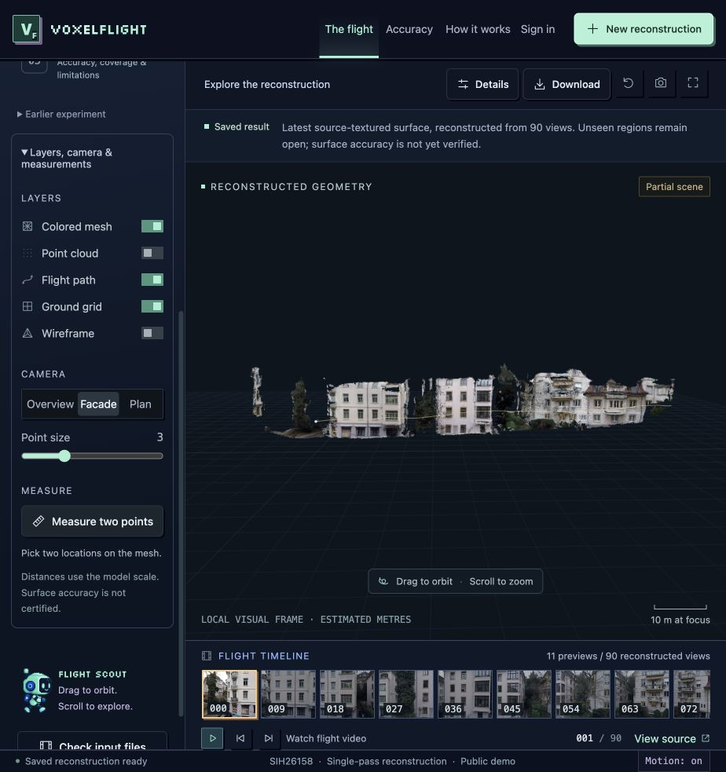
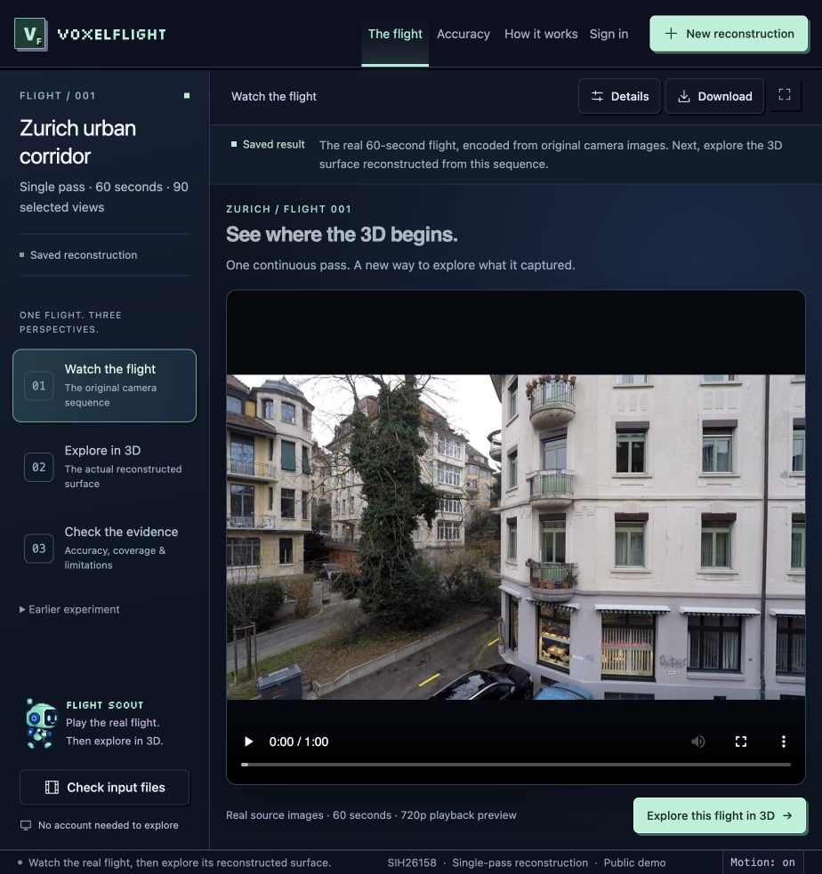

# VoxelFlight

Single-pass drone video reconstruction with an inspectable 3D workspace.

**[Live website](https://voxelflight-3d.web.app/)** · **[Presentation](submission/PRESENTATION.md)** · **[Demo](submission/DEMO.md)** · **[Setup](docs/setup.md)** · **[Requirements checklist](docs/requirements.md)**



*Actual source-textured reconstruction. Coverage is partial and surface accuracy remains unverified.*

## 1. Project information

| Field | Project |
|---|---|
| Product | VoxelFlight |
| PS ID | SIH26158 |
| PS title | Single-Pass Drone Video to Accurate 3D Model Generation System |
| Organisation | National Technical Research Organisation |
| Category | Software |
| Theme | Drone / Robotics |
| Registered team | Awaiting confirmation; see [team details](submission/TEAM.md) |

## 2. Problem statement

Conventional 3D mapping often needs multiple drone passes and extensive image overlap. Disaster assessment, infrastructure inspection and rapid mapping may offer only one pass. The challenge asks for georeferenced, metrically accurate terrain and structures from a moving UAV's video, GPS coordinates and flight metadata, with usable meshes or point clouds.

The requested spatial accuracy is **≤1 m**, the speed target is **less than 15 minutes for a 10-minute video**, and coverage should include the entire visible scene. The [requirement-by-requirement audit](docs/requirements.md) states what the current prototype does and does not demonstrate.

## 3. Proposed solution

VoxelFlight combines pretrained multiview geometry, visual camera estimation and available flight telemetry. It exports observed surfaces and keeps the original imagery, 3D result and accuracy evidence accessible in one browser workspace.

The public website opens on a login page. Google sign-in supports account-specific reconstruction jobs; **Explore as a guest** opens the saved demo without an account. New processing uses a separate operator-managed inference worker, not Firebase's hosting servers.

## 4. Key features

- Real 60-second camera video and synchronized sampled-frame navigation.
- On-demand Three.js mesh viewer with camera presets, layers and measurement tools.
- Actual camera-image textures on the latest saved reconstruction.
- Model/evidence downloads with local and provisional UTM coordinate descriptions.
- Video/image-sequence ingestion and supported GPS/calibration parsers.
- Firebase Google sign-in and current-user profile display.
- Authenticated FastAPI jobs, owner-restricted artifacts, bounded queue and cancellation.
- Explicit separation of input imagery, reconstructed geometry and optional appearance renders.

A ruler uses the model's estimated scale; it does not certify measured dimensions. Missing roofs and hidden backsides are not filled in and presented as observations.

## 5. Technology stack

| Layer | Implementation |
|---|---|
| Frontend | JavaScript, HTML/CSS, Three.js, Vite |
| Hosting and identity | Firebase Hosting and Firebase Authentication |
| Backend | Python, FastAPI, token verification, filesystem job records |
| Default preview model | Pretrained MapAnything on Apple MPS |
| Latest saved experiment | Calibrated COLMAP anchors, MapAnything, multiview-supported TSDF, source-image texture |
| Earlier GPU experiment | MASt3R-SLAM, MapAnything, SegFormer, telemetry fusion, optional gsplat |
| Geometry / GIS | Open3D, trimesh, PyCOLMAP, pyproj, laspy, rasterio |

## 6. Architecture

[System architecture and data flow](docs/architecture.md) distinguishes the default upload preview from the improved saved experiment. [Security and deployment boundaries](docs/security.md) explains account isolation and processing availability.

## 7. Repository structure

```text
voxelflight/
├── README.md
├── SUBMISSION_GUIDE.md
├── LICENSE
├── requirements.txt
├── submission/
│   ├── PRESENTATION.md
│   ├── DEMO.md
│   ├── TEAM.md
│   ├── VoxelFlight_SIH2026_Presentation.pptx
│   └── VoxelFlight_SIH2026_Presentation.pdf
├── docs/
│   ├── architecture.md
│   ├── setup.md
│   ├── results.md
│   ├── evaluation.json
│   ├── requirements.md
│   ├── security.md
│   └── references.md
├── assets/screenshots/
├── src/                       # Shared ingestion and geometry contracts
├── viewer/                    # Frontend and Firebase integration
├── scripts/                   # Reconstruction and evaluation experiments
├── config/
├── tests/
├── mac_reconstruct.py         # Default preview inference
├── mac_refuse.py              # Supported-surface refusion
├── mac_server.py
├── public_server.py           # Authenticated API entry point
└── public_security.py
```

This preserves the application's normal code folders, as permitted by the [NSUT reference repository](https://github.com/NSUT-SIH-26/NSUT-SIH-DEMO), and uses its required documentation and submission locations.

## 8. Final presentation

[Six-slide PowerPoint and six-page PDF](submission/PRESENTATION.md) are committed in `submission/`. The cover still needs the registered team name and ID. The final deck describes the latest 90-view, source-textured result and the actual model/web stacks, with editable architecture and detailed speaker notes. [Results.md](docs/results.md) keeps the earlier GPU experiment separate.

## 9. Demo

[Demo instructions and video links](submission/DEMO.md). A guest can inspect the saved result without a Google or GitHub account. The real source-camera video is labelled as input, not a reconstruction demo.

## 10. Screenshots

| Login-first entrance | Source-video workspace |
|---|---|
|  |  |

See [all screenshots](assets/screenshots/README.md) for the actual mesh and accuracy page. Login artwork is decorative, not scientific evidence.

## 11. Installation

Node.js 22.15+ and pnpm 10:

```sh
git clone https://github.com/Suman1108-beep/voxelflight.git
cd voxelflight/viewer
pnpm install --frozen-lockfile
node scripts/fetch-demo-assets.mjs
pnpm test
pnpm run build:firebase
```

The asset restore downloads approximately 142 MB of public demo files with SHA-256 verification. Model weights, original dataset archives and private uploads are excluded. See [setup.md](docs/setup.md) for Python/model dependencies and platform requirements.

## 12. Run

```sh
# From viewer/
pnpm dlx firebase-tools emulators:start --only hosting --project voxelflight-3d
```

Open `http://127.0.0.1:8140/` for the guest demo. Production sign-in needs a configured Firebase project. See [setup.md](docs/setup.md) to run the separate reconstruction API, use your own project or deploy the frontend.

### Recorded evidence

| Latest saved experiment | Result |
|---|---:|
| Selected views | 90 |
| Mesh triangles | 646,019 |
| Absolute trajectory RMSE | 8.649 m |
| Sim(3)-aligned trajectory RMSE | 0.397 m |
| Surface accuracy | Not measured |

Reference poses enter evaluation only. The aligned camera-path score removes global alignment errors and **does not establish ≤1 m surface accuracy**. The [full evaluation protocol](docs/results.md) includes interpolation details and the earlier-run comparison.

## 13. Future scope

- Independent surface-accuracy and visible-coverage validation on unseen flights.
- A fixed-hardware ten-minute-video speed benchmark.
- Integrating the improved SfM/TSDF quality path into the default upload worker.
- More robust sensor synchronization, motion/blur handling and occlusion reporting.
- Verified FBX export and stable production inference infrastructure.
- Pinning every remaining upstream architecture dependency for reproducibility.

## Team and submission

[Team members and roles](submission/TEAM.md) still need confirmation. [SUBMISSION_GUIDE.md](SUBMISSION_GUIDE.md) lists the final checks. Repository publication is separate from submitting the college form.

## Research and licensing

[References and attribution](docs/references.md) credit the models, libraries and Zurich Urban MAV data. Third-party licenses remain in force. No blanket relicensing is implied. [LICENSE](LICENSE) records the current project licensing status.

No credentials, private user jobs, model caches or private Git history are included.

## VoxelFlight v2 (3 October 2026): A100 pipeline and measured results

The `vf2/` folder holds the A100 pipeline built after the September submission (`vf2/README.md` explains how to run it).
Every number below is measured against reference data the pipeline never reads (`vf2/RESULTS.md` has the full protocol):

| Target | Result |
|---|---|
| < 15 min for a 10-min video | **7 min 8 s** end to end on one A100 (video → OBJ, PLY, LAS, GeoTIFF DSM, GLB, FBX) |
| Spatial accuracy, model geometry | 0.55 m (held-out), 0.85 m (aerial), 0.63–0.91 m (10 min, depending on mode) median vs national airborne LiDAR |
| Spatial accuracy, absolute | 0.5 m horizontal / 0.41 m vertical with RTK input; ≈ 3.5 m with consumer GNSS |
| Visible-scene coverage | 41–59 % of visible survey points within 1 m in maximum-coverage mode (24 % in fast mode; roads up to 78 %); unseen surfaces left empty |

The public demo at <https://voxelflight-3d.web.app/workspace> shows the 10-minute run in maximum-coverage mode. Uploading a new video is not
connected to the A100: the hosted processing service is offline.
